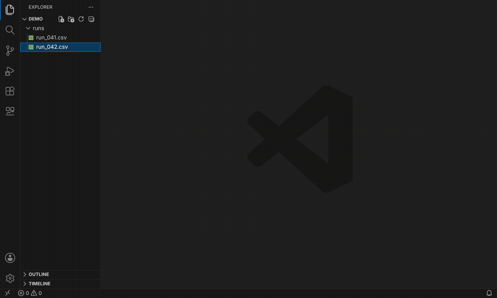
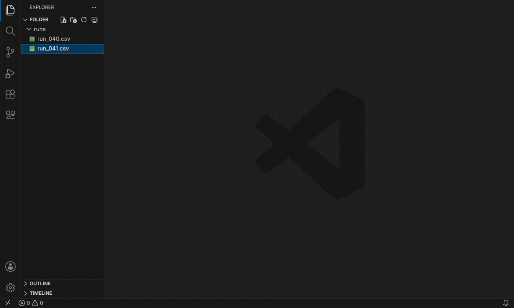
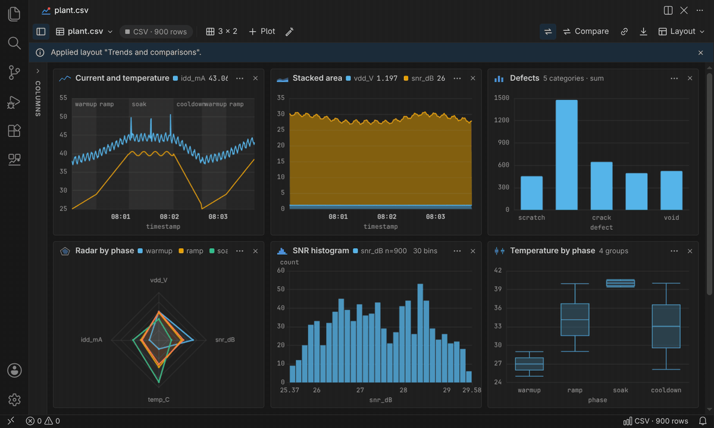
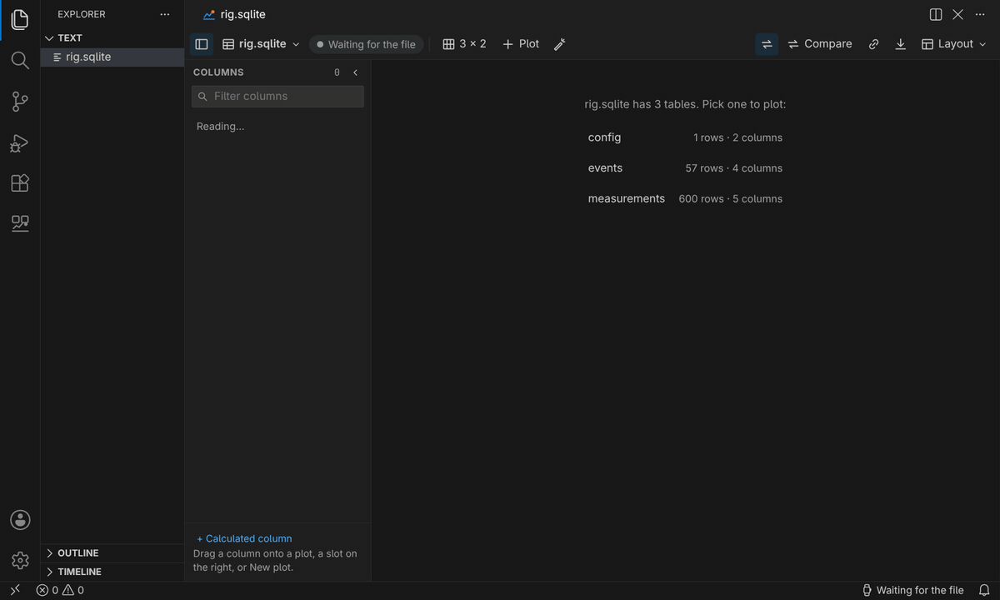
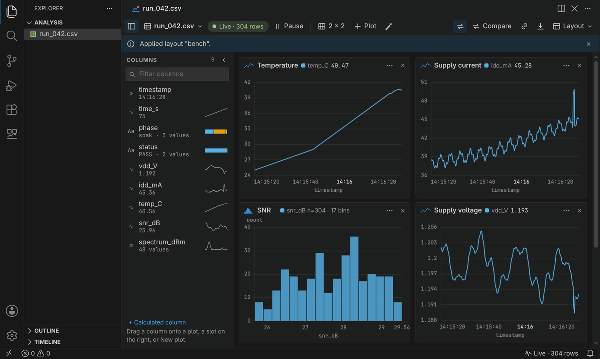
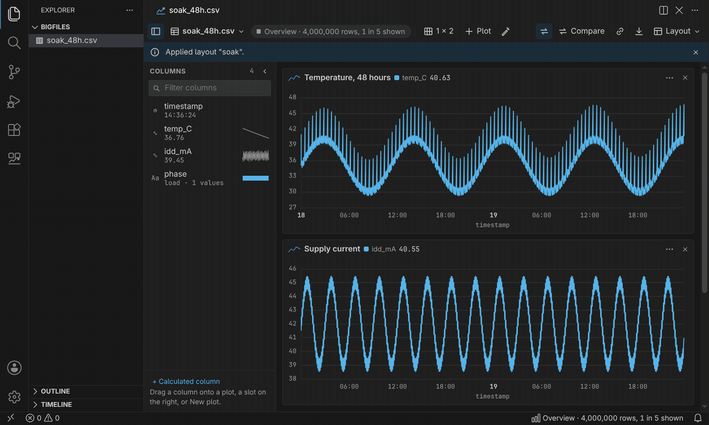

# Dynamic Liveplot

Plot any data file in VS Code, including files that are still being written. Open a CSV and it's charted straight away and keeps updating as rows arrive; drag columns to change what's plotted, from 48 chart types.

## Features

- **Plots itself.** Open a file with **Open in Dynamic Liveplot** (editor title, Explorer or Command Palette) and it's charted from its columns: numbers against time, text columns as counts, phases shaded, spectra as spectra. Drag any column onto a plot to add it, or onto the X-axis strip to plot against it.
- **Live.** Files that are still being written update as rows arrive. Half-written lines wait for their end, and renamed, emptied or replaced files are followed. Pause to look closely, then resume.
- **Watch a folder.** The newest file in a folder is always plotted, so each new run of a test appears on its own with the same layout. Overlay the previous run, dashed, to compare them.

  

- **48 chart types.** Line, area, bar, box, violin, histogram, scatter, heatmap, spectrum and spectrogram, pie, treemap, sunburst, Sankey, chord, network, candlestick, error bands, gauges, maps, 3D scatter and surface, and more. The gallery suggests the types that fit your columns, and a custom type takes any ECharts option.

  

- **CSV, TSV, JSON, JSON Lines, SQLite, Parquet and Excel.** Databases list their tables and workbooks their sheets; new rows in a SQLite table appear live. Text columns become counts, categories and splits.

  

- **Analysis.** Limits draw a dashed line and flag the plot, the status bar and a notification when crossed. Calculated columns take formulas like `idd_mA * vdd_V`. Min, max and average marks, log axes, a right-hand axis, smoothing, and cursors to measure between two points.

  

- **Big files.** A file too big to keep whole opens as an overview of every part of it; zoom in and load every row of that range. A 10 GB CSV opens in about 20 seconds.

  

- **Layouts.** Your layout is remembered for each file and folder. Save named layouts, share a folder layout with your team as `.liveplot.json`, group plots, and fill `{placeholders}` in column names.
- **Export** a plot as PNG or SVG, copy it, save the plotted rows as CSV, or save all plots as one image or an HTML report that opens anywhere.
- Fast with hundreds of live plots. Works offline and follows your theme.

## Requirements

- VS Code 1.90 or later, on Windows, macOS or Linux.

## Known Issues

- Excel support covers `.xlsx` workbooks, not the older `.xls` format.
- A file too big to keep whole shows an evenly spaced overview; a spike between the rows shown only appears when you load every row of that part.
- The column list shows the first 400 columns of very wide files; type in its filter to find the rest.
- 3D plots export as PNG only.
- Files must be on this computer; URLs and cloud storage aren't supported.

Report issues on [GitHub](https://github.com/mashurr/dynamic-liveplot/issues).

## Release Notes

See [CHANGELOG.md](CHANGELOG.md).
